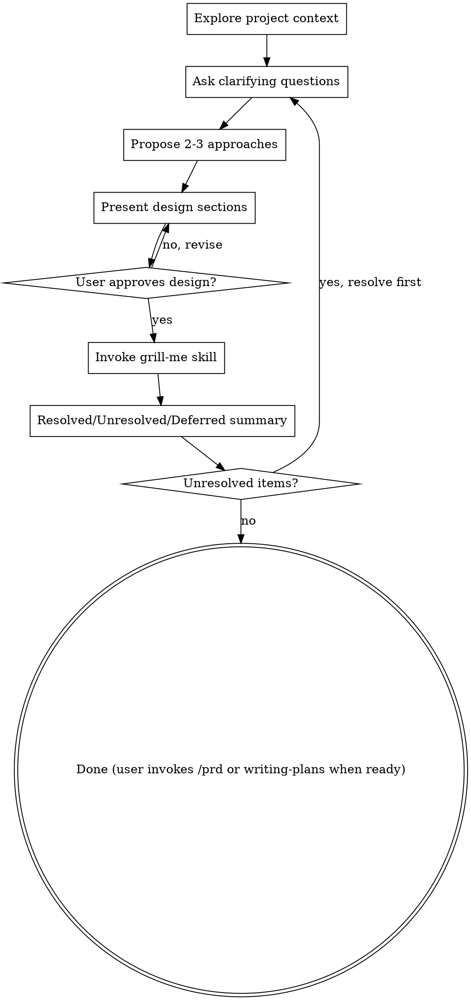

# Brainstorming Ideas Into Designs

## Overview

Help turn ideas into fully formed designs and specs through natural collaborative dialogue.

Start by understanding the current project context, then ask questions one at a time to refine the idea. Once you understand what you're building, present the design and get user approval.

<HARD-GATE>
Do NOT invoke any implementation skill, write any code, scaffold any project, or take any implementation action until you have presented a design and the user has approved it. This applies to EVERY project regardless of perceived simplicity.
</HARD-GATE>

## Anti-Pattern: "This Is Too Simple To Need A Design"

Every project goes through this process. A todo list, a single-function utility, a config change — all of them. "Simple" projects are where unexamined assumptions cause the most wasted work. The design can be short (a few sentences for truly simple projects), but you MUST present it and get approval.

## Checklist

You MUST create a task for each of these items and complete them in order:

1. **Explore project context** — check files, docs, recent commits
2. **Ask clarifying questions** — one at a time, understand purpose/constraints/success criteria
3. **Propose 2-3 approaches** — with trade-offs and your recommendation
4. **Present design** — in sections scaled to their complexity, get user approval after each section
5. **Invoke grill-me** — use the `grill-me` skill (`Skill` tool, `skill: "grill-me"`) to stress-test the approved design. `grill-me` will NOT re-invoke brainstorming — it produces a Resolved/Unresolved/Risk summary only. Continue only after that summary is generated.
6. **Resolved / Unresolved / Deferred summary** — output a short bullet list per category:
   - **Resolved:** decisions that are settled
   - **Unresolved:** open questions that must be answered before implementation begins
   - **Deferred:** items deliberately set aside (not blocking now)
   If Unresolved is non-empty, stop and resolve those questions before continuing.

**Brainstorming ends here.** After the resolved/unresolved/deferred summary is presented, the session is complete. The user will invoke `/prd` and `writing-plans` when they are ready — do not auto-invoke them.

## Godot Constraint Checklist

When designing any Godot feature, explicitly address these in your design:

| Constraint | Question to answer |
|------------|-------------------|
| **Autoloads** | Does this touch SceneManager or a future singleton? Which signals are emitted/connected? |
| **Scene tree** | Which scene owns this node? Is it instanced or a child? Does it need `@onready`? |
| **Signals** | Does UI poll state or connect to signals? (Must connect — never poll.) |
| **GDScript** | Any typed arrays, custom resources, or `@export` vars needed? |
| **Testability** | Which logic can be GUT-tested headlessly? |
| **Mobile renderer** | Any shaders or features incompatible with the Mobile renderer? |
| **Dialogue** | Does this interact with YarnSpinner? (C# integration TBD — note the open architectural question.) |
| **Battle/investigation** | Does this touch the ATB battle system or investigation mechanic? Which signals/events? |

## Process Flow

## The Process

**Understanding the idea:**
- Check out the current project state first (files, docs, recent commits)
- Ask questions one at a time to refine the idea
- Prefer multiple choice questions when possible, but open-ended is fine too
- Only one question per message — if a topic needs more exploration, break it into multiple questions
- Focus on understanding: purpose, constraints, success criteria

**Exploring approaches:**
- Propose 2-3 different approaches with trade-offs
- Present options conversationally with your recommendation and reasoning
- Lead with your recommended option and explain why

**Presenting the design:**
- Once you believe you understand what you're building, present the design
- Scale each section to its complexity: a few sentences if straightforward, up to 200-300 words if nuanced
- Ask after each section whether it looks right so far
- Cover: architecture, components, data flow, error handling, testing
- Work through the Godot Constraint Checklist explicitly for any Godot feature
- Be ready to go back and clarify if something doesn't make sense

## Key Principles

- **One question at a time** — don't overwhelm with multiple questions
- **Multiple choice preferred** — easier to answer than open-ended when possible
- **YAGNI ruthlessly** — remove unnecessary features from all designs
- **Explore alternatives** — always propose 2-3 approaches before settling
- **Incremental validation** — present design, get approval before moving on
- **Be flexible** — go back and clarify when something doesn't make sense
- **Godot constraints first** — work through the constraint checklist before finalizing any Godot design
